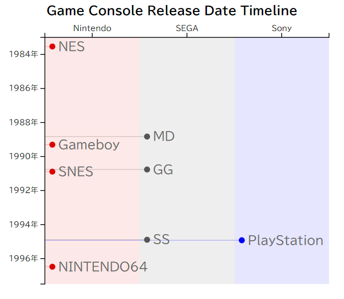

# d3-timeline

[](LICENSE)

timeline with D3.js




## Installation

Load timeline.js to your html file.

## Usage

1. Load timeline.js to your html file.
2. Set option and data.
3. Render timeline.

``` html
<div id="container"></div>
<script type="module">
    import { Timeline } from '../src/timeline.js';
    const data = [
        { "group": "Nintendo", "name": "NES", "date": "1983-07-15" },
        { "group": "Nintendo", "name": "Gameboy", "date": "1989-04-21" },
        { "group": "Nintendo", "name": "SNES", "date": "1990-11-21" },
        { "group": "Nintendo", "name": "NINTENDO64", "date": "1996-06-23" },
        { "group": "SEGA", "name": "MD", "date": "1988-10-29" },
        { "group": "SEGA", "name": "GG", "date": "1990-10-06" },
        { "group": "SEGA", "name": "SS", "date": "1994-11-22" },
        { "group": "Sony", "name": "PlayStation", "date": "1994-12-03" },
    ];
    const option = {
        width: 800,
        height: 1200
        title: "Title for Timeline",
    }

    const timeline = new Timeline('#container', data, option);
    timeline.drawVertical();
</script>
```

See detail in doc.


## License

This project is licensed under the [MIT License](LICENSE).